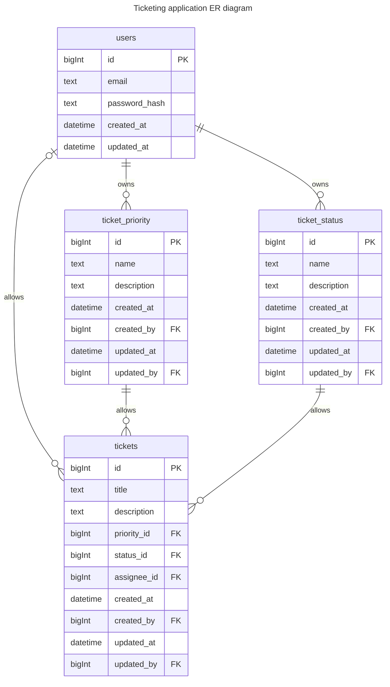

# Support Tickets

A basic support ticket system using Laravel.

## Requirements

1. A login page with database driven authentication.
2. A page with a form to submit support ticket details:
   - Title
   - Description
   - Priority (critical|high|medium|low)
3. A page to list support tickets, with ID, Title, User, Status (open/closed) and date submitted.
4. A page to view full ticket content and allow for updating of the status field.
5. All forms require validation

## ERD

