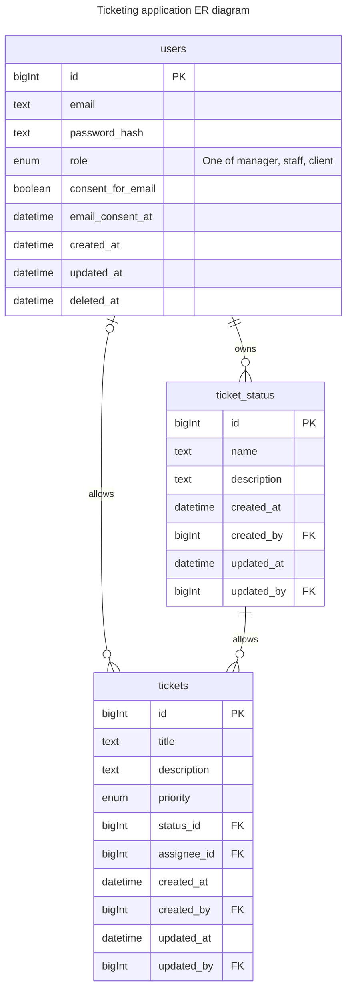

# Support Tickets

A basic support ticket system using Laravel.

## Badges


## Local Development

```shell
cp .env.example .env; \
```

Edit `.env` to include a DB_PASSWORD of your choice.

Then run the following commands to start the application:

```shell
docker network create support-tickets; \
docker compose down; \
docker compose build; \
docker compose up -d
```

Then we should connect to the app container and run the migrations:

```shell
docker compose exec -it support-tickets sh
composer install -o
php artisan key:generate;
php artisan migrate:fresh
```

## Requirements

1. A login page with database driven authentication.
2. A page with a form to submit support ticket details:
   - Title
   - Description
   - Priority (critical|high|medium|low)
3. A page to list support tickets, with ID, Title, User, Status (open/closed) and date submitted.
4. A page to view full ticket content and allow for updating of the status field.
5. All forms require validation

## ERD



